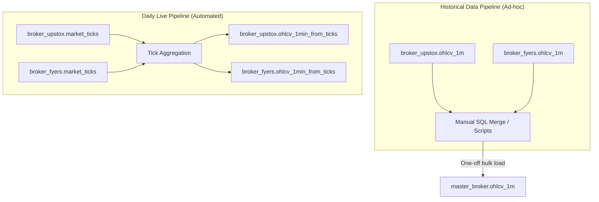

# Trading Platform Database Manifest (v1.2)
**Location:** Chennai, TN | **Last Audit:** April 26, 2026

## 1. System Architecture
The database separates raw broker data from a unified "Master" layer to ensure the Replay Engine remains broker-agnostic.

| Schema | Purpose | Retention |
| :--- | :--- | :--- |
| **`master_broker`** | Production Tier. Unified, cleaned data for strategy & backtesting. | Permanent |
| **`broker_upstox`** | Archive Tier. Raw ticks and historical OHLC from Upstox. | Permanent |
| **`broker_fyers`** | Archive Tier. High-density raw ticks from Fyers. | Permanent |

---

## 2. Core Database Wrapper Scripts

These are the primary launchers that execute the data pipelines outlined in this document.

### `run_daily_capture_eod_workflow.bat`
- **Type:** Thin Launcher (PowerShell Wrapper)
- **Primary Role:** The master orchestrator. It manages the full lifecycle of a trading day, including authentication, timing the start/stop of recorders, and triggering the EOD pipeline.
- **Tables Touched:** `broker_fyers.market_ticks`, `broker_upstox.market_ticks`, `broker_upstox.options_greeks_live`.

### `run_eod_tick_aggregation.bat`
- **Type:** Processing Wrapper
- **Primary Role:** Converts high-density tick data into 1-minute OHLC bars for both brokers.
- **Tables Touched:** Reads `market_ticks`, Writes `ohlcv_1min_from_ticks`.

### `run_eod_live_capture_check.bat`
- **Type:** Audit & Backup Wrapper
- **Primary Role:** Performs database integrity checks post-market and executes automated SQL backups of the database.
- **Tables Touched:** Reads `market_ticks`, Executes full `trading_db` dump.

---

## 3. Table Dictionary & Samples

### 🏛️ Production Tier (`master_broker`)

#### 📂 `master_broker.symbol_master`
*Unified mapping of broker-specific keys to human symbols.*
- **All Columns:** `human_symbol` (PK, TEXT), `upstox_key` (TEXT), `fyers_key` (TEXT), `expiry_date` (DATE), `strike_price` (NUMERIC).
- **Sample Extract:**
  | human_symbol | upstox_key | fyers_key | expiry_date | strike_price |
  | :--- | :--- | :--- | :--- | :--- |
  | `NIFTY_2026-04-30_22500_CE` | `NSE_FO\|54321` | `NSE:NIFTY2643022500CE` | `2026-04-30` | `22500.0` |
- **Data Pipeline (Input Process):** 
  - **Source:** Daily official instrument master CSV files provided by the brokers.
  - **Script:** `NSE/scripts/symbols_sync_script.py`.
  - **Execution:** Triggered post-market (approx. 15:50 IST) via the `run_daily_capture_eod_workflow.bat` wrapper script. The script parses the CSVs, generates the standardized `human_symbol`, aligns the broker keys, and performs an upsert into the database. 
  - **Can we miss a day?** You can afford to miss it and run it the next morning *before* the market opens. However, if completely missed, any newly issued option contracts (new strikes/expiries) will fail to be mapped during live capture, leading to missing data for those specific contracts.

#### 📂 `master_broker.ohlcv_1m`
*Unified 1-minute OHLC feed merged from historical broker archives.*
- **All Columns:** `time` (TIMESTAMPTZ), `symbol` (TEXT), `open_fyers` (NUMERIC), `high_fyers` (NUMERIC), `low_fyers` (NUMERIC), `close_fyers` (NUMERIC), `vol_fyers` (BIGINT), `open_upstox` (NUMERIC), `high_upstox` (NUMERIC), `low_upstox` (NUMERIC), `close_upstox` (NUMERIC), `vol_upstox` (BIGINT), `master_close` (NUMERIC), `is_outlier` (BOOLEAN).
- **Sample Extract:**
  | time | symbol | master_close | is_outlier |
  | :--- | :--- | :--- | :--- |
  | `2026-04-24 09:15:00+05:30` | `NSE:NIFTY50-INDEX` | `22450.55` | `FALSE` |
- **Data Pipeline (Input Process):**
  - **Source:** `broker_upstox.ohlcv_1m` and `broker_fyers.ohlcv_1m`.
  - **Script:** Manual SQL merge (`sql_scripts/firsttime_master_db_creation_dbeaver.sql`) or ad-hoc scripts.
  - **Execution:** Run on-demand when new bulk historical data is imported. Not populated by the live daily capture pipeline.

#### 📂 `master_broker.options_ohlc_1m_fromupstox`
*Primary Backtest Source. Enriched with Nifty Spot and Metadata.*
- **All Columns:** `time` (TIMESTAMPTZ), `symbol` (TEXT), `open` (NUMERIC), `high` (NUMERIC), `low` (NUMERIC), `close` (NUMERIC), `volume` (BIGINT), `strike_price` (NUMERIC), `expiry_date` (DATE), `option_type` (TEXT), `nifty_spot` (NUMERIC), `is_stale_spot` (BOOLEAN).
- **Sample Extract:**
  | time | symbol | close | strike_price | expiry_date | nifty_spot |
  | :--- | :--- | :--- | :--- | :--- | :--- |
  | `2026-04-24 09:15` | `NIFTY26APR22500CE` | `455.5` | `22500.0` | `2026-04-30` | `22450.55` |
- **Data Pipeline (Input Process):**
  - **Source:** Base options data from `broker_upstox.options_ohlc`, Spot prices joined from `master_broker.ohlcv_1m`.
  - **Script:** `scripts/lib/sync_options_to_master.py`.
  - **Execution:** Runs automatically at 16:30 IST during the daily capture workflow to enrich options data for backtesting.

#### 📂 `master_broker.v_combined_ticks` (VIEW)
*Unified Tick View joining raw data with Symbol Master.*
- **All Columns:** `source` (TEXT), `human_symbol` (TEXT), `expiry_date` (DATE), `strike_price` (NUMERIC), `option_type` (TEXT), `time` (TIMESTAMPTZ), `ltp` (DOUBLE PRECISION), `volume` (BIGINT), `bid` (DOUBLE PRECISION), `ask` (DOUBLE PRECISION).
- **Sample Extract:**
  | source | human_symbol | time | ltp | bid | ask |
  | :--- | :--- | :--- | :--- | :--- | :--- |
  | `upstox` | `NIFTY_2026-05-05_20100_PE` | `10:15:33` | `21.35` | `21.0` | `23.7` |
- **Data Pipeline (Input Process):**
  - **Source:** Live dynamic join across `broker_upstox.market_ticks`, `broker_fyers.market_ticks`, and `master_broker.symbol_master`.
  - **Script:** DB View created via migration schemas.
  - **Execution:** Real-time view queried dynamically by the Replay Engine for high-fidelity tick playback.

---

### 📦 Archive Tier - Upstox (`broker_upstox`)

#### 📂 `broker_upstox.market_ticks`
*Raw tick data captured from Upstox WebSocket.*
- **All Columns:** `time` (TIMESTAMPTZ), `symbol` (TEXT), `price` (NUMERIC), `volume` (BIGINT).
- **Sample Extract:**
  | time | symbol | price | volume |
  | :--- | :--- | :--- | :--- |
  | `14:30:05.123` | `NSE_INDEX\|Nifty 50` | `22455.10` | `150` |
- **Data Pipeline (Input Process):**
  - **Source:** Upstox WebSocket live feed.
  - **Script:** `services/data_collector/live_recorder.py`.
  - **Execution:** Runs continuously during market hours (09:15-15:30 IST) managed by `run_daily_capture_eod_workflow.bat`.

#### 📂 `broker_upstox.ohlcv_1m`
*Official 1-minute OHLC archive fetched from Upstox API.*
- **All Columns:** `time` (TIMESTAMPTZ), `symbol` (TEXT), `open` (DOUBLE PRECISION), `high` (DOUBLE PRECISION), `low` (DOUBLE PRECISION), `close` (DOUBLE PRECISION), `volume` (BIGINT).
- **Sample Extract:**
  | time | symbol | open | close | volume |
  | :--- | :--- | :--- | :--- | :--- |
  | `2024-08-01 09:15` | `NSE_INDEX\|India VIX` | `14.2` | `14.5` | `0` |
- **Data Pipeline (Input Process):**
  - **Source:** Upstox Historical API.
  - **Script:** Ad-hoc historical download scripts (e.g., `scripts/download_vix.py`).
  - **Execution:** Run manually or on-demand for bulk data ingestion. Not part of the daily automated workflow.

#### 📂 `broker_upstox.ohlcv_1min_from_ticks`
*Bars generated locally from captured ticks (Daily aggregate).*
- **All Columns:** `time` (TIMESTAMPTZ), `symbol` (TEXT), `open` (DOUBLE PRECISION), `high` (DOUBLE PRECISION), `low` (DOUBLE PRECISION), `close` (DOUBLE PRECISION), `volume` (BIGINT), `source_table` (TEXT), `aggregation_timeframe` (TEXT), `aggregation_run_at` (TIMESTAMPTZ).
- **Sample Extract:**
  | time | symbol | open | close | source_table |
  | :--- | :--- | :--- | :--- | :--- |
  | `2026-04-24 10:00` | `NSE_INDEX\|Nifty 50` | `22400.1` | `22405.5` | `market_ticks` |
- **Data Pipeline (Input Process):**
  - **Source:** Local `broker_upstox.market_ticks` table.
  - **Script:** `scripts/lib/aggregate_ticks_to_1min.py`.
  - **Execution:** Runs automatically post-market at 16:00 IST via `run_eod_tick_aggregation.bat` to compress the day's live ticks into bars.

#### 📂 `broker_upstox.options_ohlc`
*Historical options candles with Open Interest (OI) and Greeks.*
- **All Columns:** `time` (TIMESTAMPTZ), `symbol` (TEXT), `open` (DOUBLE PRECISION), `high` (DOUBLE PRECISION), `low` (DOUBLE PRECISION), `close` (DOUBLE PRECISION), `volume` (BIGINT), `oi` (BIGINT), `calc_implied_volatility` (DOUBLE PRECISION), `calc_delta` (DOUBLE PRECISION), `instrument_key` (VARCHAR).
- **Sample Extract:**
  | time | symbol | close | oi | calc_delta |
  | :--- | :--- | :--- | :--- | :--- |
  | `2026-04-07 09:15` | `NIFTY26APR22500CE` | `455.5` | `1250000` | `-0.024` |
- **Data Pipeline (Input Process):**
  - **Source:** Upstox Historical API.
  - **Script:** `services/data_collector/scripts/upstox_options_sync.py` and `run_upstox_options_sync_all_days.py`.
  - **Execution:** Run on-demand for bulk historical options backfill.

#### 📂 `broker_upstox.options_greeks_live`
*Real-time Greeks captured during the market session.*
- **All Columns:** `time` (TIMESTAMPTZ), `symbol` (TEXT), `delta` (DOUBLE PRECISION), `theta` (DOUBLE PRECISION), `gamma` (DOUBLE PRECISION), `vega` (DOUBLE PRECISION), `iv` (DOUBLE PRECISION).
- **Sample Extract:**
  | time | symbol | delta | theta | iv |
  | :--- | :--- | :--- | :--- | :--- |
  | `10:15:33.442` | `NSE_FO\|73639` | `-0.0711` | `-5.588` | `14.2` |
- **Data Pipeline (Input Process):**
  - **Source:** Upstox WebSocket (Full Mode) live feed.
  - **Script:** `services/data_collector/live_recorder.py`.
  - **Execution:** Runs continuously during market hours alongside market ticks.

---

### 📦 Archive Tier - Fyers (`broker_fyers`)

#### 📂 `broker_fyers.market_ticks`
*High-density raw ticks (includes Bid/Ask).*
- **All Columns:** `time` (TIMESTAMPTZ), `symbol` (TEXT), `price` (DOUBLE PRECISION), `bid` (DOUBLE PRECISION), `ask` (DOUBLE PRECISION), `volume` (BIGINT).
- **Sample Extract:**
  | time | symbol | price | bid | ask |
  | :--- | :--- | :--- | :--- | :--- |
  | `11:20:01.881` | `NSE:NIFTY2641322650CE` | `510.15` | `512.9` | `514.5` |
- **Data Pipeline (Input Process):**
  - **Source:** Fyers WebSocket live feed.
  - **Script:** `services/data_collector/live_recorder.py`.
  - **Execution:** Runs continuously during market hours (09:15-15:30 IST).

#### 📂 `broker_fyers.ohlcv_1m`
*Official 1-minute OHLC archive from Fyers.*
- **All Columns:** `time` (TIMESTAMPTZ), `symbol` (TEXT), `open` (DOUBLE PRECISION), `high` (DOUBLE PRECISION), `low` (DOUBLE PRECISION), `close` (DOUBLE PRECISION), `volume` (BIGINT).
- **Sample Extract:**
  | time | symbol | open | close | volume |
  | :--- | :--- | :--- | :--- | :--- |
  | `2026-04-24 09:15` | `NSE:NIFTY50-INDEX` | `22450.0` | `22455.5` | `0` |
- **Data Pipeline (Input Process):**
  - **Source:** Fyers Historical API.
  - **Script:** Ad-hoc historical download scripts.
  - **Execution:** Run manually or on-demand for bulk data ingestion.

#### 📂 `broker_fyers.ohlcv_1min_from_ticks`
*Bars generated locally from Fyers ticks.*
- **All Columns:** `time` (TIMESTAMPTZ), `symbol` (TEXT), `open` (DOUBLE PRECISION), `high` (DOUBLE PRECISION), `low` (DOUBLE PRECISION), `close` (DOUBLE PRECISION), `volume` (BIGINT), `source_table` (TEXT), `aggregation_timeframe` (TEXT), `aggregation_run_at` (TIMESTAMPTZ).
- **Sample Extract:**
  | time | symbol | open | close | source_table |
  | :--- | :--- | :--- | :--- | :--- |
  | `2026-04-24 10:00` | `NSE:NIFTY50-INDEX` | `22400.1` | `22405.5` | `market_ticks` |
- **Data Pipeline (Input Process):**
  - **Source:** Local `broker_fyers.market_ticks` table.
  - **Script:** `scripts/lib/aggregate_ticks_to_1min.py`.
  - **Execution:** Runs automatically post-market at 16:00 IST via `run_eod_tick_aggregation.bat`.

---

## 4. Data Flow Pipelines

This diagram illustrates the dual paths that feed the Master unified OHLC feed. Historical data is merged manually or via ad-hoc scripts, while daily live captures are aggregated and merged automatically.

---

## 5. Daily Operations Timeline (IST)
The platform follows a strict schedule to ensure data integrity from pre-market to final archive.

| Time (IST) | Phase | Interaction | Script / Launcher | Data Flow (Source ➔ Destination) |
| :--- | :--- | :--- | :--- | :--- |
| **08:30** | **Auth Gate** | 👤 **Manual** | `run_daily_capture_eod_workflow.bat` | Broker API ➔ `config/auth/` (Tokens) |
| **09:00** | **Capture Start** | 🤖 **Auto** | `run_daily_capture_eod_workflow.bat` | WebSocket ➔ Background Workers |
| **09:15-15:30**| **Live Trading**| 🤖 **Auto** | `services/data_collector/live_recorder.py` | Feed ➔ `broker_X.market_ticks` / `greeks_live` |
| **15:45** | **Stop Capture** | 🤖 **Auto** | `run_daily_capture_eod_workflow.bat` | Stop Signal ➔ Workers Shutdown |
| **15:50** | **Master Sync** | 🤖 **Auto** | `NSE/scripts/symbols_sync_script.py` | CSV Masters ➔ `master_broker.symbol_master` |
| **16:00** | **Aggregation** | 🤖 **Auto** | `run_eod_tick_aggregation.bat` | `market_ticks` ➔ `ohlcv_1min_from_ticks` |
| **16:30** | **Options Sync** | 🤖 **Auto** | `scripts/lib/sync_options_to_master.py` | `broker_upstox.options_ohlc` ➔ `master_broker.options_ohlc_1m_fromupstox` |
| **17:00** | **Audit & Backup**| 🤖 **Auto** | `run_eod_live_capture_check.bat` | `market_ticks` ➔ Integrity Logs / `.sql` Backup |

> [!NOTE]
> The **Auth Gate** is the only manual checkpoint. Once tokens are valid, `run_daily_capture_eod_workflow.bat` manages the timing and execution of all subsequent steps until the final audit.

---

## 6. Script Inventory (Detailed)

### 6.1 Daily Operations Scripts
| Script | Purpose | Tables / Data |
| :--- | :--- | :--- |
| `live_recorder.py` | Real-time tick & Greek capture. | `market_ticks`, `options_greeks_live` |
| `symbols_sync_script.py` | Link Upstox/Fyers keys via CSV. | `symbol_master` |
| `aggregate_ticks_to_1min.py` | Ticks -> OHLC (Broker level). | `ohlcv_1min_from_ticks` |
| `sync_options_to_master.py` | Sync Upstox OHLC + Spot + Metadata. | `options_ohlc_1m_fromupstox` |
| `db_backup.py` | Automated rolling DB dumps. | Full `trading_db` backup |

### 6.2 Historical Data Downloaders
These scripts are used exclusively for backfilling the `ohlcv_1m` archive tables. They are run manually or on-demand and are **not** part of the daily automated workflow.

| Script | Purpose | Target Tables |
| :--- | :--- | :--- |
| `scripts/download_vix.py` | Downloads historical 1-minute data for the India VIX index using the Upstox API. *(Can be easily adapted to backfill Spot/Index data like Nifty 50).* | `broker_upstox.ohlcv_1m` |
| `upstox_options_sync.py` | Robust, rate-limited downloader for historical 1-minute OHLC and Open Interest data for expired options contracts. | `broker_upstox.options_ohlc` |
| `run_upstox_options_sync_all_days.py` | Batch orchestrator that runs the options sync script over a wide date range to backfill massive amounts of data for backtesting. | `broker_upstox.options_ohlc` |