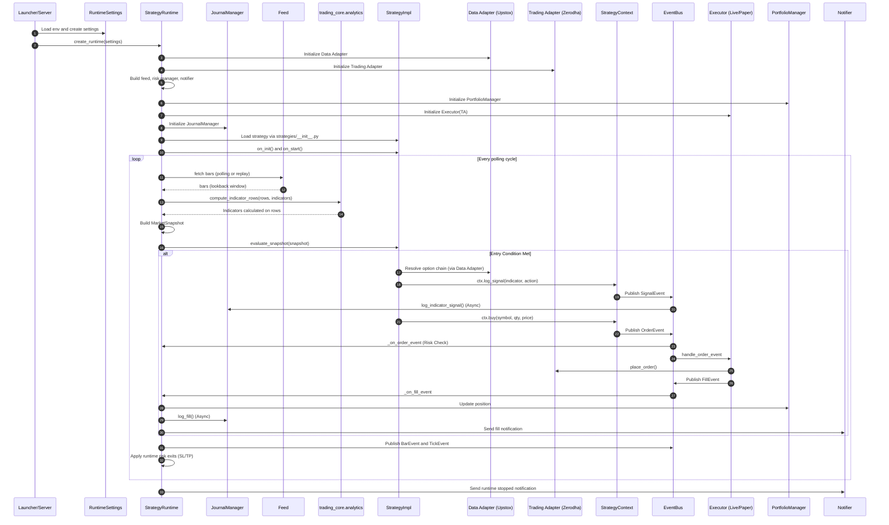
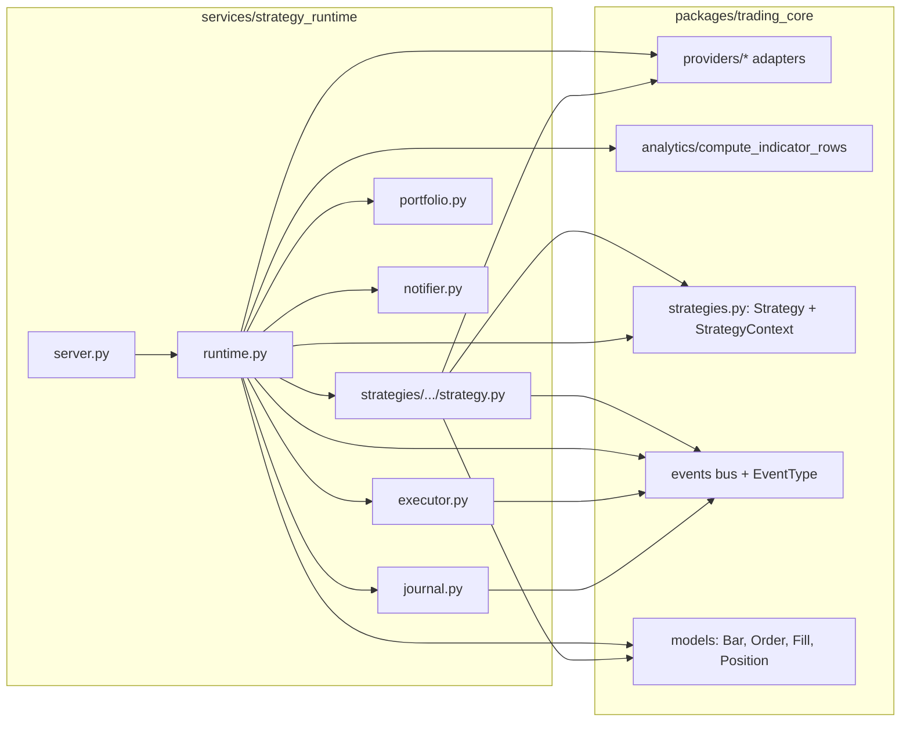

# Strategy Runtime Architecture Diagrams

This file is intentionally diagram-first and rewrite-friendly.

If architecture changes (performance refactors, queueing changes, execution path changes), update only the Mermaid blocks below and keep section titles stable.

## 1) End-to-End Runtime Sequence

## 2) Ownership Boundary (strategy_runtime vs trading_core)

## 3) Fast Update Checklist

When performance architecture changes, update these first:

1. Feed behavior in Diagram 1 (polling vs replay vs streaming path)
2. Execution path in Diagram 1 (sync/async, queue, batch, retry)
3. Boundary ownership in Diagram 2 (what moved from strategy_runtime to trading_core, or vice versa)
4. Notification path in Diagram 1 (inline vs async worker)

## 4) Suggested Versioning Note (optional)

Add a single line at top when you revise:

- Updated on: YYYY-MM-DD
- Reason: short note (for example: moved indicator compute off main loop)
